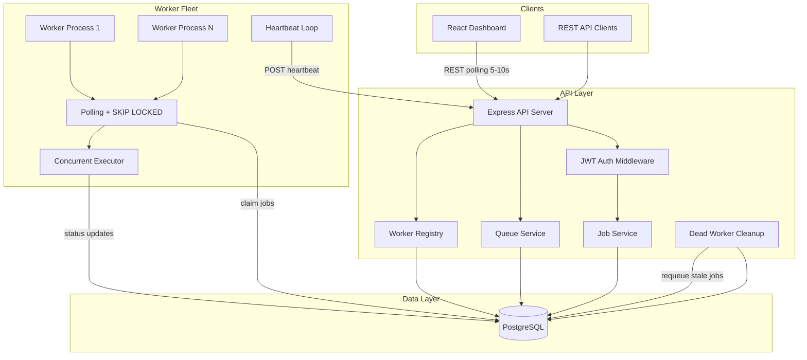
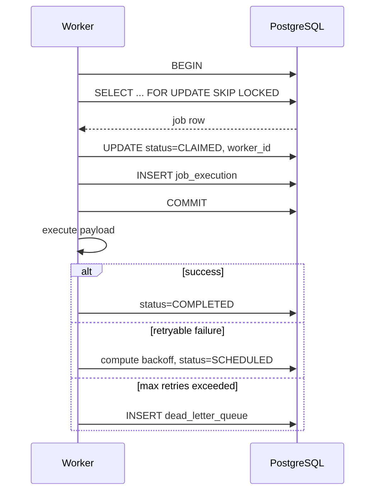
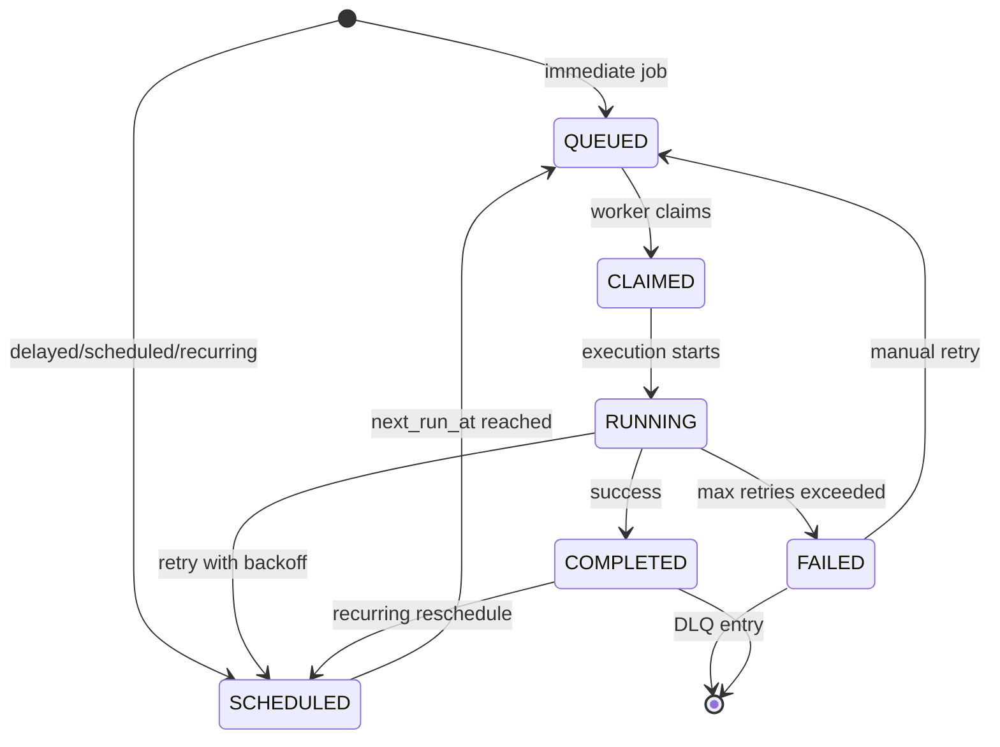

# System Architecture

## Overview

The Distributed Job Scheduler follows a **decoupled monolithic API + distributed workers** architecture. The API server handles authentication, job ingestion, and administrative operations. Independent worker processes poll PostgreSQL for work, claim jobs atomically, and execute them concurrently.

## Component Diagram

## Job Claiming Sequence

## Job Lifecycle State Machine

## Deployment Topology

| Component | Scaling | Notes |
|-----------|---------|-------|
| API Server | Horizontal (stateless) | Behind load balancer |
| Worker Fleet | Horizontal | Scale based on queue depth |
| PostgreSQL | Vertical + read replicas | Single source of truth |
| Dashboard | Static CDN | Nginx serves built assets |

## Key Design Principles

1. **Database as queue** — PostgreSQL row locking eliminates duplicate execution without Redis
2. **Stateless workers** — Any worker can claim any job; no sticky sessions
3. **Transactional state changes** — All status transitions within DB transactions
4. **Heartbeat-based liveness** — Dead workers detected within 30 seconds
